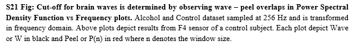
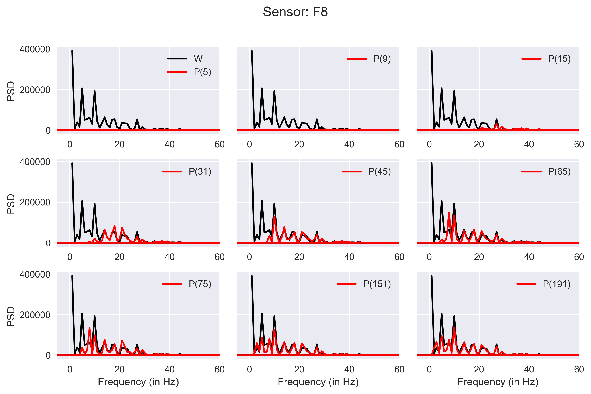
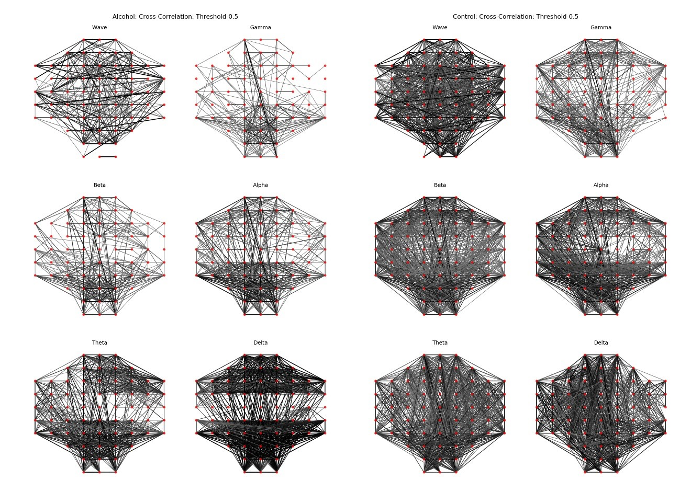
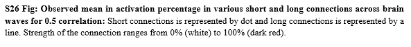

# Signal-Processing and Visualization of Electroencephalogram (EEG) data

## Detection of long and short connection from EEG signals of 122 Alcoholic and Control subjects recorded across 64 sensors.  
This repository contains scripts developed during my 11-month part-time internship at CSIR-CDRI, India.

Dataset: <a href='https://archive.ics.uci.edu/ml/datasets/eeg+database' target='_blank'> Link </a>

## Web-Page
Published Web-Page is available <a href="https://newtein.github.io/eeg/" target="_blank"> here.</a>

## Sampling and Power Spectral Density Analysis

    
    

    
    

## Connections derived from cross-correlations

    
    

## Activation

    
    

## Frequency-band Analysis: Dissolution into Alpha, Beta, Gamma, Theta and Delta waves
### Activation of Alpha waves

    
    

Similar analysis is performed over Beta, Gamma, Theta and Delta waves.

## Publication
Details will be made available after publication of inferences in a relevant journal. 
